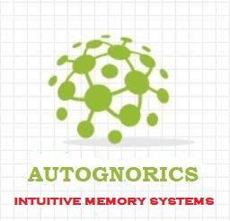

# Paradigm Shift: A Brain Without The Brain
[HOME](https://autognorics.github.io/) 

In his book, Biotronics: The Making of a Conscious Machine, Joey Lawsin disclosed his theory on Aneural Consciousness, a rationale that claims Consciousness does not need to emerge from the Brain. He called this idea as A Brain without the Brain Paradigm or the Brein Theory that claims that everything is made up of at least two inherent information stored in its structures, shapes, or geometries. Through this myriad of binary memories (brein), intelligence emerges from this set of logics. Short excerpts from his book below reveal some of his findings on Intuitive Aneural Networks(IAN).

A simple string telephone is as an excellent illustration of what a system is, what it does, what it consists of, and how it is triggered. The string telephone, a classic toy, consists of two cans connected by a string. Each can have a hole at the bottom center, through which the string is threaded. When information is sent into one can, it travels along the string and is received at the other end, leaving out from the second can.

In any system, there are always six major components present. Technically, they are the incoming message called the input, the flowing message called the medium, and the outgoing message called the output. In addition, the first can, where the input enters, is called the collector; the string, where the medium flows, is called the carrier; and the other can, where the output leaves, is called the actuator. However, the trigger, an external source, is the seventh and most important element in the system.

Also, the six major elements of a system can be divided into two parts. The input, medium, and output are the first part of the system; while, the collector, carrier, and actuator are the second part. The first parts are all by-materials while the second parts are all material objects. All materials and by-materials combined are singularly called Physicals. This concept of material and by-material is one of the most important aspects of understanding a system.

For example, in the Basic Intuitive Aneural Network System drawing below, the switch serves as the collector, the wires as the carrier, and the light bulb as the actuated. The input signal comes from the switch, then flows into the medium, and releases as output (e.g. light). On the other hand, the battery in the illustration serves only as the energy source to make the system alive. Here, the stored information is triggered by an external source, collected as input, processed either on or off, and sent as output without using any neuron or brain. The information is stored and processed in the switch as On or Off. The two units of information can also be represented as 0 or 1, Dit or Dah, Up or Down, Black or white, or shell or twig.

Some examples of the linear aneural work systems of intuitive networks that stores and processes information in a queue without a brain and its six major elements are illustrated below:

> "Just because you have a brain doesn't mean you are conscious;
just because you are alive doesn't mean you have a brain."
~ Joey Lawsin
